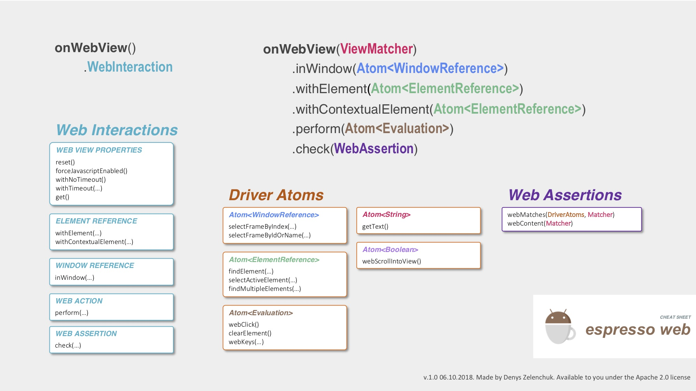
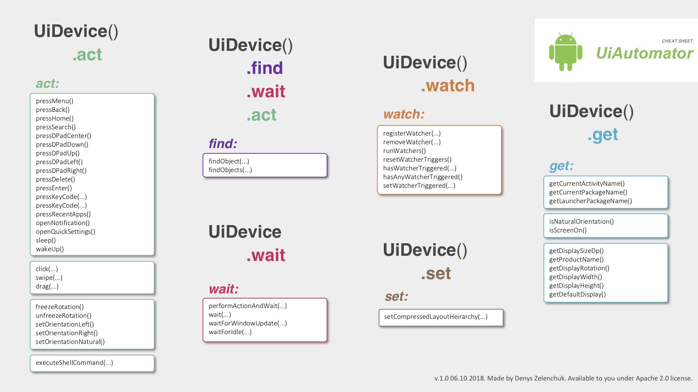

# android-espresso-revealed

A sample TO-DO application project forked from the [googlesamples android-architecture](https://github.com/googlesamples/android-architecture/tree/master) project and modified in a way to show you most of the Espresso use cases.

### Content:
#### chapter1
Explains how to identify Android application UI elements, perform actions, assertions and apply matchers to them.

#### chapter2
Contains more advanced examples of how to implement custom ViewAction, including clicks and swiping actions; ViewMatcher, such as: matching complex views, RecyclerView matchers or Drawable matchers. It will be shown how to use custom actions and matchers, implement custom FailureHandler.

#### chapter3
Is about migrating existing Espresso Java tests to Kotlin. It also provides an example of creating Espresso DSL in Kotlin.

#### chapter4
Explains how to handle application network requests or long-lasting operations during test execution with the help of IdlingResource interface. Provides an example about ConditionalWatcher as an alternative to IdlingResource.

#### chapter5
Shows IntentMatchers usage inside the application under test as well as possibility to stub external intents and provide back extras. Contains an example of external intent stubbing that selects an image from the photo gallery.

#### chapter6
Gives an overview about testing WebViews inside application under test. Implemented WebViews will showcase different UI elements that Espresso-Web API is able to operate on. The Espresso-Web cheat sheet is also the part of this chapter content and is available in ./app/src/androidTest/assets folder.

#### chapter7
Current chapter unleashes the topic of how to test application accessibility using Espresso for Android. It raises awareness about the importance of Accessibility testing and gives an overview of manual tools that can be used to test application accessibility.

#### chapter8
Shows one of the most powerful test automation setups for Android, which combines Espresso test framework together with UI Automator testing tool. Contains the examples of how to test notifications or operate on third party apps during Espresso tests execution. The Espresso-Web cheat sheet is also the part of this chapter content and is available in ./app/src/androidTest/assets folder.

#### chapter9
Explains different ways of how we can deal with system permission request dialogs.

#### chapter10
Demonstrates how to set device in test friendly state to reduce test flakiness. Contains test examples generated by Espresso Test Recorder.

#### chapter11
Shows how to apply Screen Object (the same as Page Object) architecture approach in Android test project which allows to reduce maintenance effort spent on test maintenance.

#### chapter12
Contains examples of how to apply Testing Robot Pattern which splits the test implementation from the business logic to Espresso UI tests.

#### chapter13
Gives an example of how to implement supervised pseudo monkey tests using Espresso and UI Automator which can be applicable for applications you have access to the source code to and for the third-party applications.

#### chapter14
Demonstrates how to migrate the test code from Android Support to AndroidX Test library and how Truth library can be used in UI tests.

#### chapter15
Contains code samples that were not covered in other chapters and Espresso testing tips which may increase your daily test writing productivity. It includes creating Parametrized tests, aggregating tests into Test Suites, using AndroidStudio Live templates in UI tests, setting SeekBar progress in Espresso UI tests and Espresso Drawable matchers topics.

### Espresso-Web cheat sheet:

### UI Automator cheat sheet:

